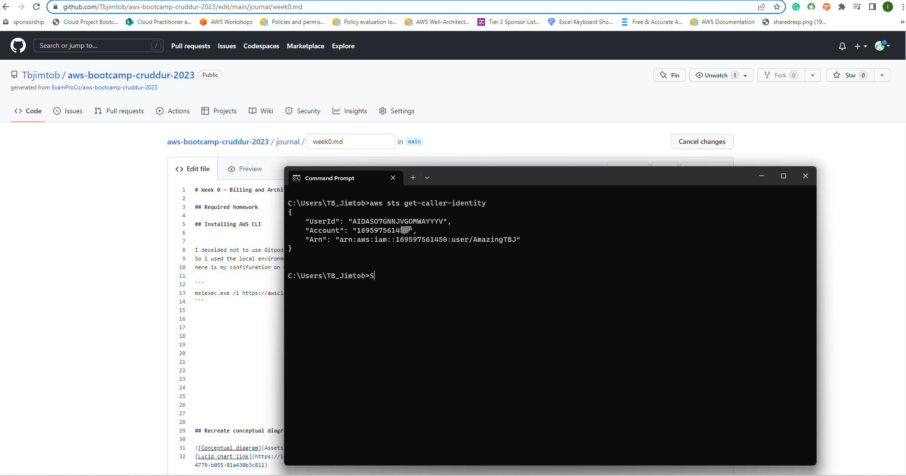
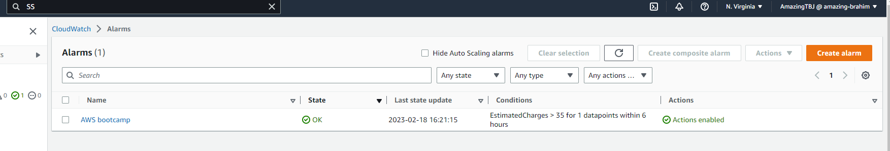
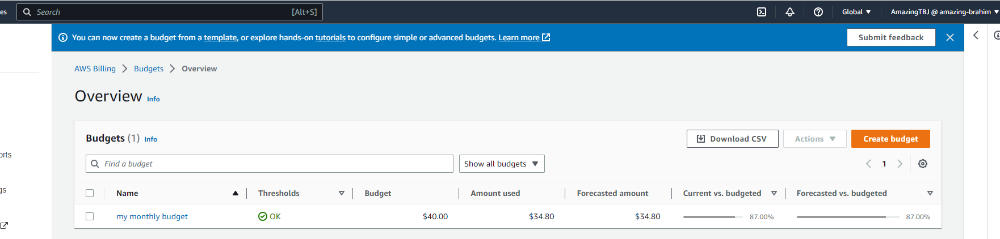
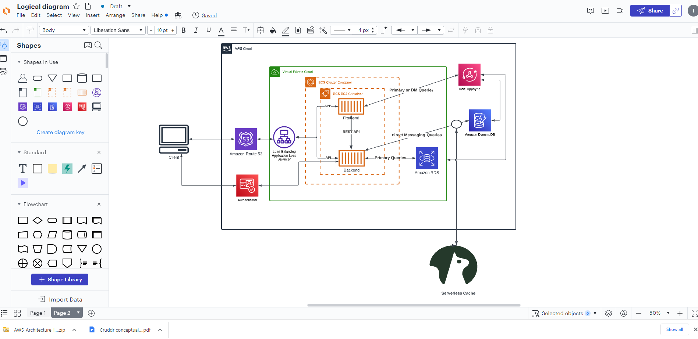

# Week 0 — Billing and Architecture

## Required homework

## Installing AWS CLI 


I deceided not to use Gitpod so as to preserve Gitpod free credit for computing we will be doing during the bootcamp
So i used the local environment.
here is the proof of my confifuration on my window:

```
msiexec.exe /i https://awscli.amazonaws.com/AWSCLIV2.msi
```


## Billing alert

I set my billing alert to $35.
Here is the screenshot of my billing alert 


## Budget

I set my Budget to $40.
Here is the screenshot of my Budget



## Cruddur logical diagram


Here is the[Link](https://lucid.app/lucidchart/722461c4-e0ee-4315-988f-7d3c0344f854/edit?invitationId=inv_e695b989-c290-4779-b055-81a430b3c811&page=exryeL7mQxpm#)


## Cruddur Napkin


Here is the [link](https://lucid.app/lucidchart/722461c4-e0ee-4315-988f-7d3c0344f854/edit?viewport_loc=-205%2C-381%2C2219%2C1055%2C0_0&invitationId=inv_e695b989-c290-4779-b055-81a430b3c811)
